**Report for Assignment 1**

**Project chosen**

Name: **Python-Prompt-Toolkit**

URL: <https://github.com/prompt-toolkit/python-prompt-toolkit>

Number of lines of code and the tool used to count it: **39446** lines. Tool used: **Lizard** Programming language: **Python**

**Coverage measurement**

**Existing tool**

We used the existing tool called Coverage.py to measure the coverage. To do so we 

Installed the following Python packages: coverage, pytest. To measure the coverage in the source directory, we first needed to run the tests, using the command “coverage run -m pytest”. To see the results and coverage, we executed “coverage report” to see it in the command line, and ‘coverage html --omit="tests/" --include="src/"’ to see a more detailed HTML version of the coverage. 

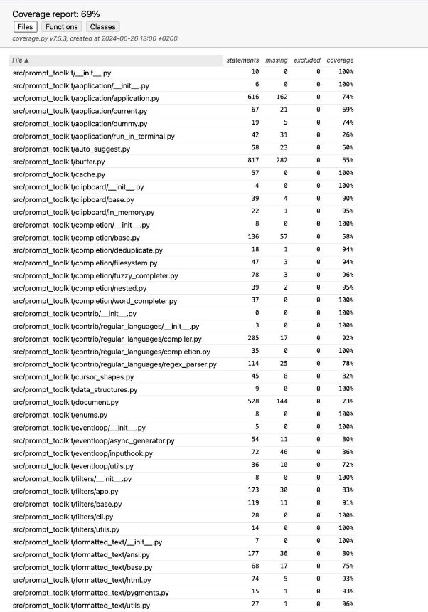

**Kirill Nikolaevskii Own coverage tool:**

**“\_commonprefix”** from **“src/prompt\_toolkit/completion/base.py”**

Link:  [https://github.com/knikolaevskii/SEP_python-prompt-toolkit/commit/3e6985fa33d58842abec25454c0 baf5e9c982bb8](https://github.com/knikolaevskii/SEP_python-prompt-toolkit/commit/3e6985fa33d58842abec25454c0baf5e9c982bb8)

Screenshot of the coverage results output by the instrumentation:

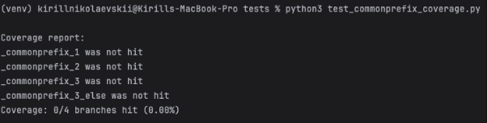

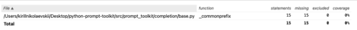

**“is\_dimension”** from **“src/prompt\_toolkit/layout/dimension.py”**

Link:

[https://github.com/knikolaevskii/SEP_python-prompt-toolkit/commit/e4909690356ac3747f1e 4a0d47d8670000cf37b8](https://github.com/knikolaevskii/SEP_python-prompt-toolkit/commit/e4909690356ac3747f1e4a0d47d8670000cf37b8)

Screenshot of the coverage results output by the instrumentation:

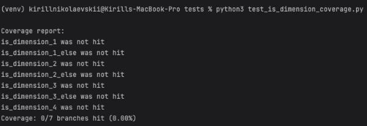

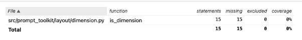

**Coverage improvement: Test 1.**

Link: [https://github.com/knikolaevskii/SEP_python-prompt-toolkit/commit/f7743cfd58a5cb39cf39dd3a08f 573fa051cd0bd](https://github.com/knikolaevskii/SEP_python-prompt-toolkit/commit/f7743cfd58a5cb39cf39dd3a08f573fa051cd0bd)

Screenshot of the **old** coverage results:

Screenshot of the **new** coverage results:

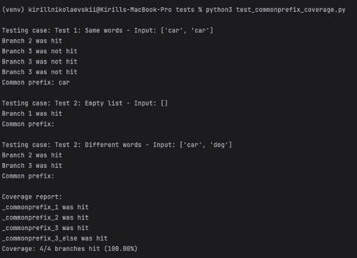

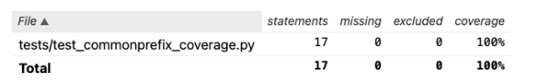

**Overview**:

The coverage was improved by 100% because the initial set of tests did not hit any of the conditional branches of the \_commonprefix function. The enhanced tests used additional cases to call the tested function with inputs that hit all the branches. The input of an empty array of strings hits the first branch, which is triggered if there are no strings. The input of two equal strings ['car', 'car'] led to hitting the second branch, which is triggered by a non-empty array of strings. 

Finally, the third branch was hit with the input ['car', 'dog'], which passed through the else statement for the second branch and then led to the execution of the third branch, as it expects that some character of the minimal string is different from the maximum string at the same index. Thus, the coverage was increased by 100% for this function as the new cases hit all branches.

**Test 2.**

Link: [https://github.com/knikolaevskii/SEP_python-prompt-toolkit/commit/ab9afba5a15cd60f887627a91f0 416683917a441](https://github.com/knikolaevskii/SEP_python-prompt-toolkit/commit/ab9afba5a15cd60f887627a91f0416683917a441)

Screenshot of the **old** coverage results:

Screenshot of the **new** coverage results:

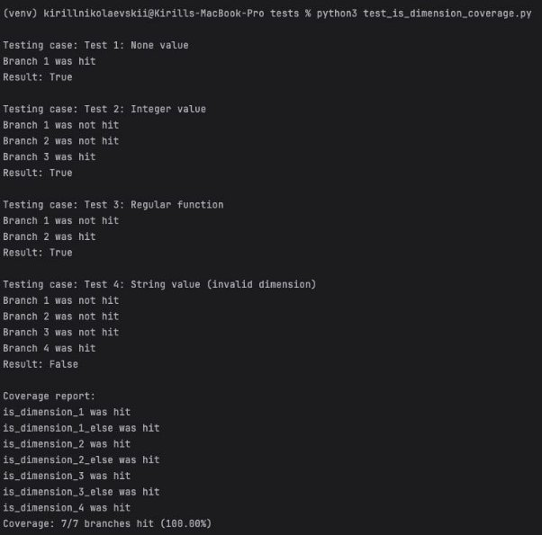

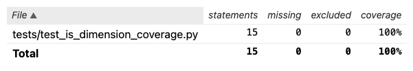

**Overview**:

The coverage was improved by 100% because the initial set of tests did not hit any of the conditional branches of the is\_dimension function. The enhanced test executed additional cases that led to hitting all conditional branches. For instance, the input of a None value triggered the execution of Branch 1, which is an if statement that expects such input. Additionally, the integer input led to the execution of Branch 3, which has an if statement expecting an integer. 

Moreover, the input of a regular function led to the execution of Branch 2, which has an if statement for a callable function. Lastly, when there was a string input, Branch 4 was executed as it is the default case when the input of the is\_dimension function is incorrect. In conclusion, the coverage was improved by adding 4 use cases that hit all the previously unexecuted conditional branches.

**Rovshan Tamirov Own coverage tool:**

“**to\_dimension**” from “**src/prompt\_toolkit/layout/dimension.py**”

Link: [https://github.com/knikolaevskii/SEP_python-prompt-toolkit/commit/a268b4aa575ba93d085 ed089e3b054f349ab12fd](https://github.com/knikolaevskii/SEP_python-prompt-toolkit/commit/a268b4aa575ba93d085ed089e3b054f349ab12fd) 

Screenshot of the coverage results output by the instrumentation:

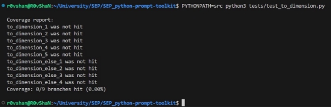

“**merge\_processors**” from “**src/prompt\_toolkit/layout/processors.py**”

Link: [https://github.com/knikolaevskii/SEP_python-prompt-toolkit/commit/3898385d9ac11dd3ede 02f84beaadde69a3a8fdf](https://github.com/knikolaevskii/SEP_python-prompt-toolkit/commit/3898385d9ac11dd3ede02f84beaadde69a3a8fdf) 

Screenshot of the coverage results output by the instrumentation:

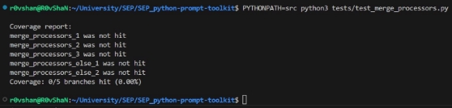

**Coverage improvement: Test 1.**

Link: [https://github.com/knikolaevskii/SEP_python-prompt-toolkit/commit/f8e6d56b56b76ec6d3a9579d7b 945db6f17c7d6d](https://github.com/knikolaevskii/SEP_python-prompt-toolkit/commit/f8e6d56b56b76ec6d3a9579d7b945db6f17c7d6d)

Screenshot of the **old** coverage results:

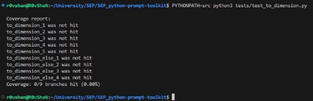

Screenshot of the **new** coverage results:

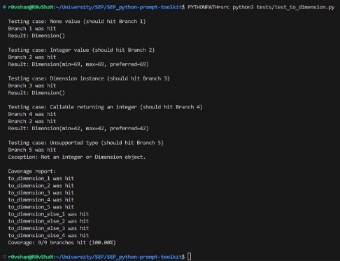

**Overview**:

The reason for the improvement is as follows. Mainly, since the original repository didn’t test out the function mentioned above, the coverage without additional tests was 0%. After adding the additional tests focused on each of the branches, the coverage increased by 100%.

**Test 2.**

Link: [https://github.com/knikolaevskii/SEP_python-prompt-toolkit/commit/6fadf7d66bdd56c6c7e11e1ceea 859f642472050](https://github.com/knikolaevskii/SEP_python-prompt-toolkit/commit/6fadf7d66bdd56c6c7e11e1ceea859f642472050)

Screenshot of the **old** coverage results:

Aspose.Words.da29ccc9-e68a-4423-a983-a0d39818e8d2.011.jpeg

Screenshot of the **new** coverage results:

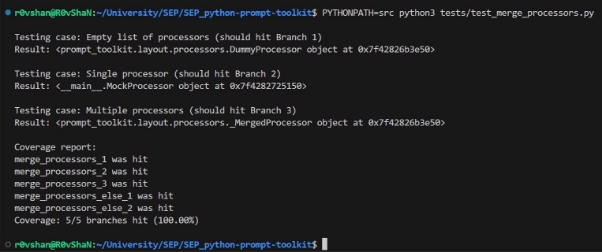

**Overview**:

The reason for such an improvement in the coverage has already been mentioned above. The original repository didn’t test out the function mentioned above, the coverage without additional tests was 0%. After adding the additional tests focused on each of the branches, the coverage increased by 100%.

**Daniil Malygin Own coverage tool:**

**“find\_next\_matching\_line”** from “**document.py”**

Link: [https://github.com/knikolaevskii/SEP_python-prompt-toolkit/commit/ae26bfdf11366217cac1](https://github.com/knikolaevskii/SEP_python-prompt-toolkit/commit/ae26bfdf11366217cac1a3ebb0054402056ab240)

[a3ebb0054402056ab240](https://github.com/knikolaevskii/SEP_python-prompt-toolkit/commit/ae26bfdf11366217cac1a3ebb0054402056ab240)

Screenshot of the coverage results output by the instrumentation:

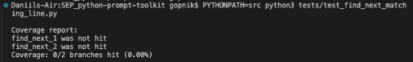

**“find\_previous\_matching\_line”** from “**document.py”**

Link: [https://github.com/knikolaevskii/SEP_python-prompt-toolkit/commit/dd1c578b57f619cd1bc2320cb0 7ded85737c225a](https://github.com/knikolaevskii/SEP_python-prompt-toolkit/commit/dd1c578b57f619cd1bc2320cb07ded85737c225a)

Screenshot of the coverage results output by the instrumentation:

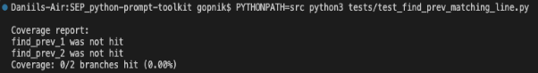

**Coverage improvement: Test 1.**

Link: [https://github.com/knikolaevskii/SEP_python-prompt-toolkit/commit/b71160dc6db29693ffc83fde983 4ab9a4c89d8f5](https://github.com/knikolaevskii/SEP_python-prompt-toolkit/commit/b71160dc6db29693ffc83fde9834ab9a4c89d8f5)

Screenshot of the **old** coverage results:

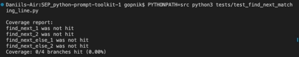
Screenshot of the **new** coverage results:

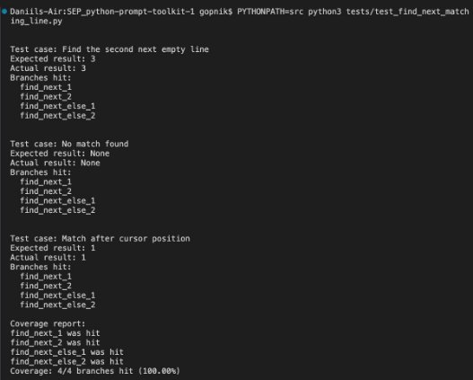

**Overview**:

The coverage was improved by 100% because the original set of tests was empty and did not cover any of the conditional branches of the **find\_next\_matching\_line** function. The enhanced test suite executed additional cases that led to hitting all conditional branches. For example, the input text with multiple empty lines triggered the execution of Branch 1, which is an if statement that expects such input to find the second **next** empty line.

In conclusion, the coverage was improved by adding 3 use cases that hit all the previously unexecuted conditional branches, ensuring comprehensive testing of the **find\_next\_matching\_line** function.

**Test 2.**

Link: [https://github.com/knikolaevskii/SEP_python-prompt-toolkit/commit/5bfd91aa0de9dc61a57279218b d904d9fb0ac9f7](https://github.com/knikolaevskii/SEP_python-prompt-toolkit/commit/5bfd91aa0de9dc61a57279218bd904d9fb0ac9f7)

Screenshot of the **old** coverage results:

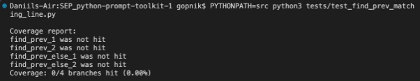

Screenshot of the **new** coverage results:

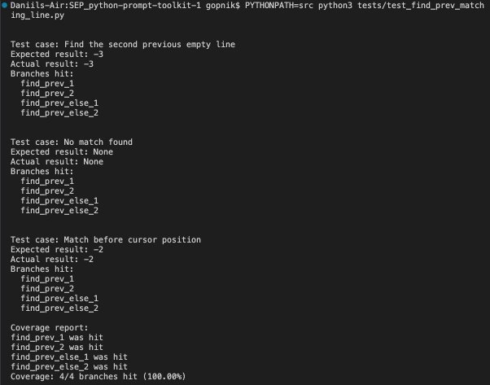

**Overview**:

The coverage was improved by 100% because the original set of tests was empty and did not cover any of the conditional branches of the **find\_prev\_matching\_line** function. The enhanced test suite executed additional cases that led to hitting all conditional branches. For example, the input text with multiple empty lines triggered the execution of Branch 1, which is an if statement that expects such input to find the second **previous** empty line.

In conclusion, the coverage was improved by adding 3 use cases that hit all the previously unexecuted conditional branches, ensuring comprehensive testing of the **find\_previous\_matching\_line** function.

**Bence Matajsz Own coverage tool:**

**Insert\_line\_above** from **buffer.py**

Link: https://github.com/prompt-toolkit/python-prompt-toolkit/commit/daeccc3cb0855bfd87a9a3e4c1cc4cb bf965c661

Screenshot of the coverage results output by the instrumentation:

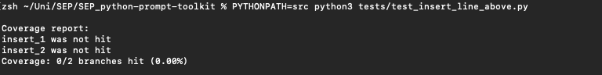

**translate\_row\_col\_to\_index** from **document.py**

Link: https://github.com/prompt-toolkit/python-prompt-toolkit/commit/daeccc3cb0855bfd87a9a3e4c1cc4cb bf965c661

Screenshot of the coverage results output by the instrumentation:

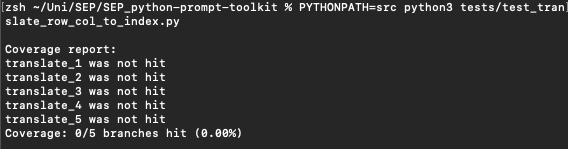

**Coverage improvement: Test 1.**

Link: https://github.com/prompt-toolkit/python-prompt-toolkit/commit/daeccc3cb0855bfd87a9a3e4c1cc4cb bf965c661

Screenshot of the **old** coverage results:

Screenshot of the **new** coverage results:

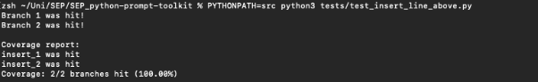

**Overview**:

The default coverage was 0%, as there were no tests checking branch coverage for this function. After adding test cases covering each branch, I managed to get the coverage up to 100%. There are two possibilities, the copy\_margin argument of the function either being true or false. Both cases are tested, ensuring the function is covered in either case.

**Test 2.**

Link: https://github.com/prompt-toolkit/python-prompt-toolkit/commit/daeccc3cb0855bfd87a9a3e4c1cc4cb bf965c661

Screenshot of the **old** coverage results:

Screenshot of the **new** coverage results:

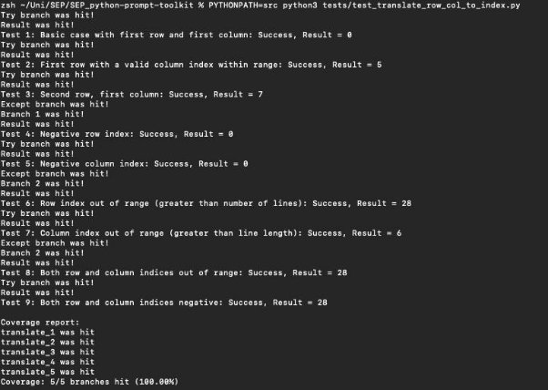

**Overview**:

The default coverage was 0%, as there were no tests checking branch coverage for this function. After adding test cases covering each branch, I managed to get the coverage up to 100%. There are multiple branches in this function, so I created 9 test cases to make sure everything is covered well. These test cases ensure that all branches are covered, including all try-except and if-else blocks. The remaining code after the try-except block is also checked, making sure it is executing properly. A wide variety of arguments are being checked, including out-of-range values. 

Screenshot of the old coverage results by running an existing tool:

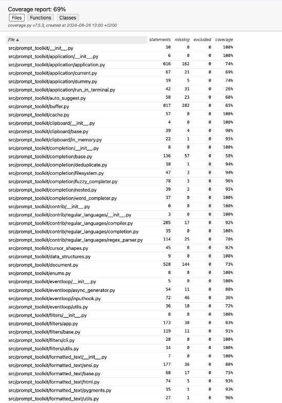

Screenshot of the new coverage results by running the existing tool using all test modifications made by the group:

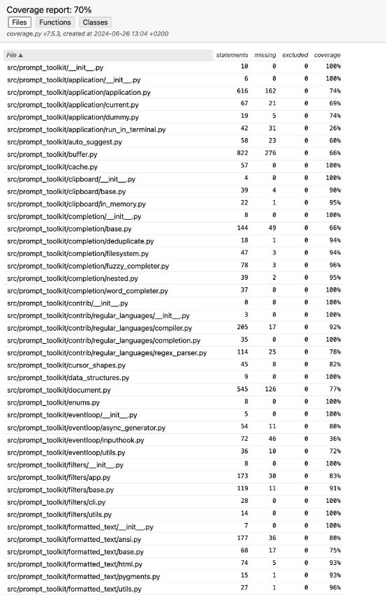

**Kirill Nikolaevskii**

- Own Coverage Tool: Improved coverage for the \_commonprefix function in src/prompt\_toolkit/completion/base.py and the is\_dimension function in src/prompt\_toolkit/layout/dimension.py by writing additional tests and documenting the results.

**Rovshan Tamirov**

- Coverage Improvement: Focused on the to\_dimension function in src/prompt\_toolkit/layout/dimension.py and the merge\_processors function in src/prompt\_toolkit/layout/processors.py. Added tests to improve coverage, documented the results, and provided screenshots showing the coverage improvement.

**Daniil Malygin**

- Coverage Improvement: Worked on the find\_next\_matching\_line and find\_previous\_matching\_line functions in document.py. Added tests to ensure comprehensive branch coverage and documented the coverage improvements with screenshots.

**Bence Matajsz**

- Coverage Improvement: Improved coverage for the insert\_line\_above function in buffer.py and the translate\_row\_col\_to\_index function in document.py. Added tests to cover all branches, including various cases to ensure thorough testing. Documented the results and provided screenshots of the coverage improvements.

